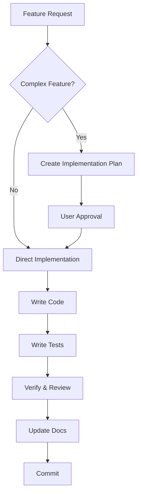

# AI Coding Rules for Neo-rag Project (Antigravity Edition)

This document contains the complete and authoritative set of rules for this project when working with **Antigravity** as your AI pair programmer. These rules adapt and extend the original CLAUDE.md for the Antigravity workflow.

---

## 1. Core Principles

These are the non-negotiable foundations of our development process.

1. **Docs are Law**: All development must strictly adhere to the project documentation. The primary sources of truth are:
   - `GEMINI.md` (this file) - AI collaboration rules
   - `docs/architecture.md` - System design
   - `docs/AGENT_WORKFLOWS.md` - Runtime behaviors
   
2. **No Guessing**: If a requirement is unclear or missing, **stop work immediately**. Ask for clarification. Do not make assumptions.

3. **No Drift**: Do not deviate from the approved architecture, technology stack, or workflows without explicit, documented approval.

4. **Simplicity First**: Do not over-engineer. Implement the simplest solution that meets the requirements.

5. **Plan Before Execute**: For any feature that touches more than 2 files, create an implementation plan and get approval before coding.

---

## 2. Project Structure & Naming Conventions

### 2.1. Folder Structure

```
Neo-rag/
├── backend/app/           # Python backend (FastAPI)
│   ├── database/          # Database connectors
│   ├── models/            # Pydantic models
│   └── services/          # Business logic
├── frontend/              # React + TypeScript
├── docs/                  # Documentation (*.md)
├── plans/                 # Feature execution plans
├── tests/                 # Test suites
├── .agent/workflows/      # Antigravity workflows
└── examples/              # Reference implementations
```

### 2.2. Naming Conventions

| Language | Variables/Functions | Classes/Components | Files |
|----------|--------------------|--------------------|-------|
| Python | `snake_case` | `PascalCase` | `snake_case.py` |
| TypeScript | `camelCase` | `PascalCase` | `camelCase.tsx` |

---

## 3. Code Quality & Style

### 3.1. Type Safety
- **Python**: Use type hints for ALL function parameters and returns
- **TypeScript**: Use strict mode, no `any` types without justification

### 3.2. Indentation
- Python: 4 spaces
- TypeScript/JavaScript: 2 spaces

### 3.3. Function Design
- Single responsibility - one function does one thing
- Max 30 lines per function (soft limit)
- Clear inputs and outputs

### 3.4. Error Handling
```python
# ✅ CORRECT
try:
    result = external_api_call()
except ExternalAPIError as e:
    logger.error(f"API call failed: {e}")
    raise HTTPException(status_code=502, detail="External service unavailable")

# ❌ WRONG
result = external_api_call()  # No error handling
```

### 3.5. Docstrings (Required for all functions)
```python
def process_document(text: str, metadata: dict) -> int:
    """
    Process and ingest a document into the system.
    
    Args:
        text: The raw document content to process.
        metadata: Additional metadata about the source.
    
    Returns:
        Number of chunks successfully ingested.
    
    Raises:
        DatabaseConnectionError: If vector DB is unavailable.
    """
```

---

## 4. Development Workflow with Antigravity

### 4.1. Feature Development Flow



### 4.2. Antigravity-Specific Practices

1. **Context7 for Docs**: Use the Context7 MCP server to get latest library documentation:
   ```
   When implementing LangChain features, query Context7 for current API patterns
   ```

2. **Artifact-Driven Planning**: For complex features:
   - Create `implementation_plan.md` in brain artifacts
   - Get explicit approval before coding
   - Create `walkthrough.md` after completion

3. **Incremental Commits**: After each logical unit of work:
   - Run tests
   - Verify functionality
   - Prepare atomic commit

4. **GitHub Integration**: Use the GitHub MCP server for:
   - Creating issues for bugs found
   - Creating PRs with proper descriptions
   - Managing branches

### 4.3. Workflow Commands

Create these in `.agent/workflows/`:

| Workflow | Purpose |
|----------|---------|
| `/dev-server` | Start backend + frontend servers |
| `/test` | Run full test suite |
| `/deploy` | Build and verify for production |

---

## 5. Security

### 5.1. Credentials
- **NEVER** hardcode API keys or passwords
- All secrets via environment variables
- Reference: `docs/CREDENTIALS_SECURITY.md`

### 5.2. Injection Prevention

```python
# ✅ CORRECT - Parameterized query
session.run("MERGE (n:Entity {id: $id})", id=node_id)

# ❌ WRONG - String interpolation (injection risk!)
session.run(f"MERGE (n:{label} {{id: '{node_id}'}})")
```

### 5.3. Input Validation
- Validate all user inputs with Pydantic
- Sanitize before database operations
- Use prepared statements/parameterized queries

---

## 6. Testing Standards

### 6.1. Test Structure
```
tests/
├── api/              # Endpoint tests
├── database/         # DB connector tests
└── services/         # Business logic tests
```

### 6.2. Requirements
- **Coverage target**: >80% for services
- **Mock externals**: All LLM calls, DB connections in unit tests
- **Integration tests**: Separate from unit tests

### 6.3. Running Tests
```bash
# Run all tests
pytest

# Run with coverage
pytest --cov=backend/app

# Run specific test file
pytest tests/services/test_query_service.py -v
```

---

## 7. Documentation

### 7.1. Keep Updated
| Doc | Update When |
|-----|-------------|
| `README.md` | New features, setup changes |
| `docs/AGENT_WORKFLOWS.md` | New runtime flows |
| `plans/*.md` | Each feature phase |
| API docs (auto-generated) | Endpoints change |

### 7.2. Mermaid Diagrams
- All architecture changes need updated diagrams
- Place in `docs/` with descriptive names

---

## 8. Git Practices

### 8.1. Commit Messages
```
<type>: <short description>

[optional body with details]

Types: feat, fix, docs, refactor, test, chore
```

Examples:
- `feat: add alpha weighting to query endpoint`
- `fix: resolve connection pooling issue in neon_db`
- `docs: update AGENT_WORKFLOWS with hybrid query flow`

### 8.2. Branch Strategy
- `main` - Production-ready code
- `feat/<feature-name>` - Feature branches
- `fix/<issue-description>` - Bug fixes

---

## 9. Antigravity-Specific Notes

### What's Different from Roo/Claude

| Aspect | Roo Approach | Antigravity Approach |
|--------|--------------|---------------------|
| Planning | Sequential Thinking MCP | Artifact-based implementation_plan.md |
| Context | Custom context.md | Built-in conversation context |
| Workflows | Custom modes | `.agent/workflows/*.md` |
| Knowledge | Neo4j MCP server | Task boundaries + artifacts |

### MCP Servers Available
- **Context7**: Library documentation lookup
- **GitHub**: Repo operations, issues, PRs
- **Neon**: Database operations (if configured)

---

## 10. Quick Reference

```bash
# Start development
uvicorn backend.app.main:app --reload

# Run frontend
cd frontend && npm start

# Run tests
pytest

# Check types (Python)
mypy backend/

# Lint (if configured)
ruff check backend/
```

---

*This document supersedes CLAUDE.md when working with Antigravity. Last updated: 2026-01-29*
