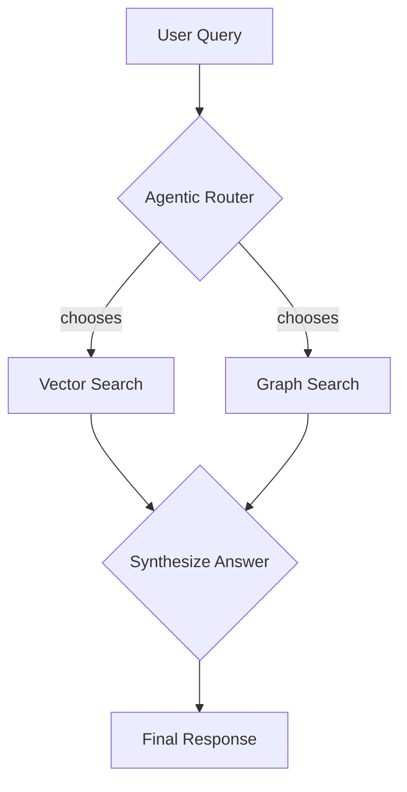
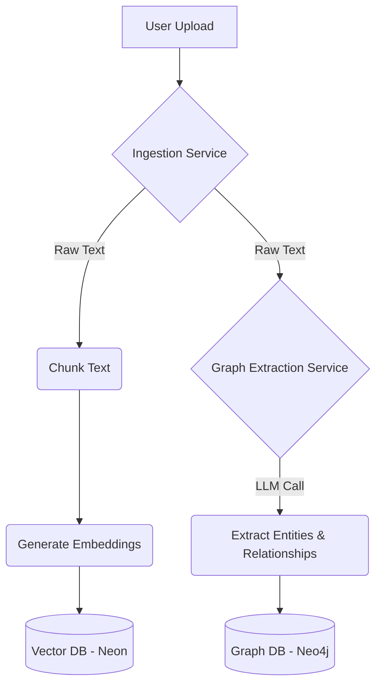
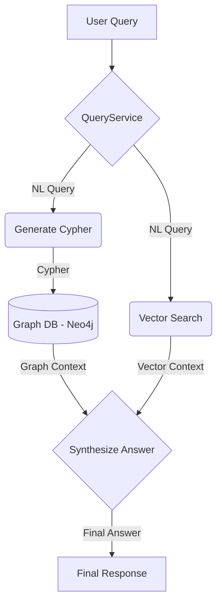

# Agent Workflows

This document outlines the workflows for both developing and operating the agents in this project.

---

## Development Workflow

This is the standard process for creating or modifying agent capabilities. It ensures that all development is planned, consistent, and aligned with project standards.

```mermaid
graph TD
    A[1. Feature Idea] --> B{Create Feature Request};
    B --> C[/templates/feature_request.md];
    C --> D{Generate Execution Plan};
    D -- reads --> E[/CLAUDE.md];
    D -- reads --> F[/docs/architecture.md];
    D -- reads --> G[examples/];
    D --> H[/plans/feature_name.md];
    H --> I{Review & Approve Plan};
    I -- Approved --> J{Switch to Code Mode};
    J --> K[Implement Feature];
    K --> L{Review Code};
    L -- Approved --> M[Merge & Complete];

    subgraph User
        A; B; I; L; M;
    end

    subgraph Roo [AI Assistant]
        D; J; K;
    end
```

---

## Runtime Agent Roles

### Push Data Agent
- Ingests documents → chunking → embedding → storage in Neon.
- Extracts entities/relationships → store in AuraDB.
- Generates schema (auto or user-provided).

### Retrieval Agent (Agentic Mode)
- **Router**: Analyzes the user query and selects the best tool (`vector_search` or `graph_search`).
- **Vector Search**: Performs similarity search in Neon for summarization or general queries.
- **Graph Search**: Performs Cypher-based search in AuraDB for relationship-based queries.
- **Synthesizer**: Generates a final answer based on the context retrieved from the chosen tool.

---

## Runtime Workflow (Retrieve Mode)



1.  **User Query** → Agentic Router
2.  The router analyzes the query and selects the best tool:
    *   For summarization or general questions → **Vector Search**.
    *   For relationship questions → **Graph Search**.
3.  The chosen tool retrieves the relevant context.
4.  The context is passed to the Synthesizer to generate the final answer.
5.  The final answer is returned to the user.

---

## Runtime Workflow (Push Mode)



1.  **User Upload** → Ingestion Service
2.  The service processes the text in two parallel paths:
    *   **Vector Path**: The text is chunked, embeddings are generated, and the results are stored in the Neon vector database.
    *   **Graph Path**: The text is sent to the `Graph Extraction Service`, which uses an LLM to extract entities and relationships. This structured data is then stored in the Neo4j graph database.
3.  The service confirms the successful ingestion of both data types.

---

## Future Extensions
- Confidence-based skip for Pass 2.
- Custom weighting of vector vs graph results.
- Real-time schema editing in UI.

---

## Runtime Workflow (Hybrid Query Mode)

This workflow uses a non-agentic, parallel retrieval strategy to gather context from both the graph and vector stores simultaneously.



1.  **User Query (with optional alpha)** → QueryService
2.  The service processes the query in two parallel paths:
    *   **Graph Path**: A Cypher query is generated from the natural language query and executed against the Neo4j database to retrieve structured graph context.
    *   **Vector Path**: An embedding is generated for the query and used to perform a similarity search against the Neon vector database to retrieve relevant unstructured text chunks.
3.  Both the graph and vector contexts are passed to a final LLM prompt to synthesize a comprehensive answer. The `alpha` parameter (0.0 to 1.0, default 0.5) controls the weighting of the contexts in the synthesis prompt.
4.  The final answer and the intermediate contexts are returned to the user.