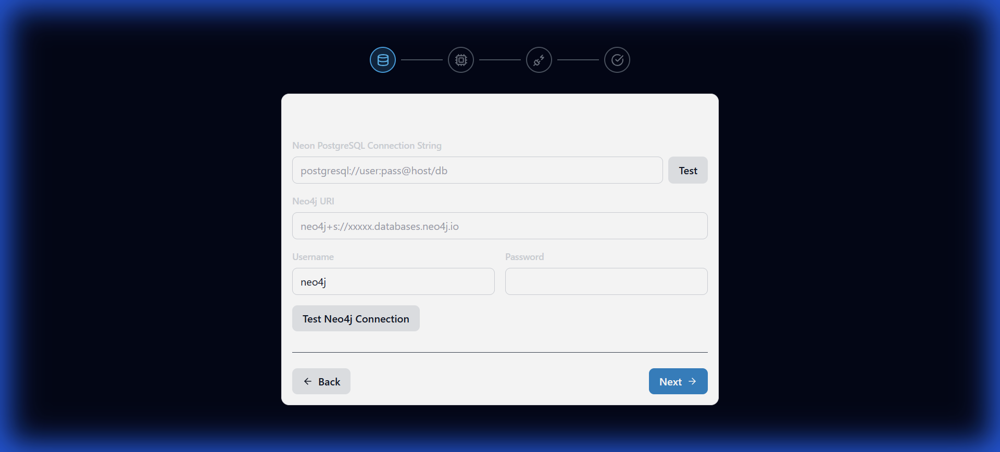
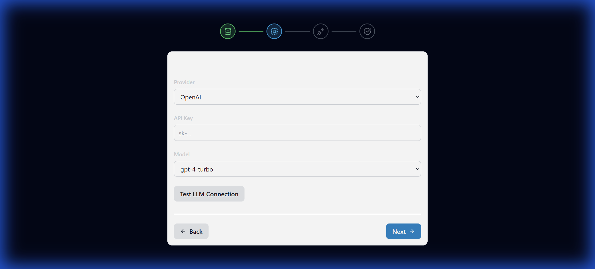
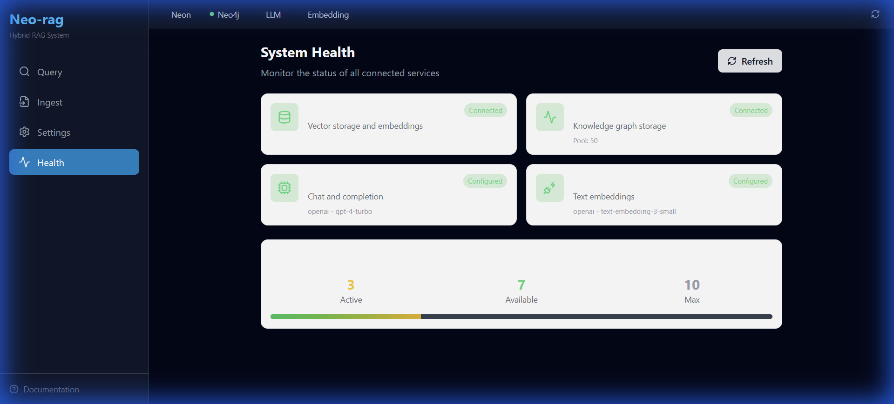
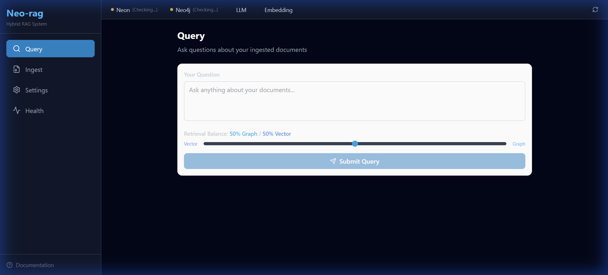
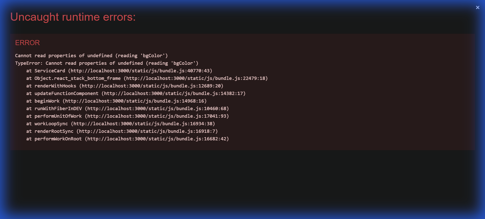

# Neo-rag v2.0 User Manual

Welcome to Neo-rag, a next-generation Hybrid RAG system that combines the semantic power of Vector Search with the structured reasoning of Knowledge Graphs.

## 🚀 Getting Started

### Prerequisites
- **Python 3.10+**
- **Node.js 18+**
- **Docker** (optional, for running Neo4j locally)
- **Neon PostgreSQL** account (or local Postgres)
- **Neo4j Aura** account (or local Neo4j)

### Installation

1. **Clone the repository**
   ```bash
   git clone https://github.com/your-username/neo-rag.git
   cd neo-rag
   ```

2. **Backend Setup**
   ```bash
   cd backend
   pip install -r requirements.txt
   cp .env.example .env  # Edit with your credentials if not using Wizard
   uvicorn app.main:app --reload
   ```

3. **Frontend Setup**
   ```bash
   cd frontend
   npm install
   npm start
   ```

4. **Access the Application**
   Open your browser and navigate to `http://localhost:3000`.

---

## 🧙 Initial Configuration (Setup Wizard)

When you launch Neo-rag for the first time, you will be greeted by the **Setup Wizard**.

### Step 1: Database Connection
Enter your connection details for Neon PostgreSQL and Neo4j.



### Step 2: LLM Provider
Select your preferred Large Language Model provider (OpenAI, Anthropic, etc.) and enter your API Key.



### Step 3: Embedding Provider
Select your embedding model provider.

Once completed, the application will initialize and redirect you to the Dashboard.

---

## 💡 Using Neo-rag

### 1. The Dashboard (Health)
The **Health Dashboard** gives you a real-time view of your system's status.



- **Green**: Service is connected and healthy.
- **Yellow**: Service is checking or has warnings.
- **Red**: Service is disconnected.
- **Pool Stats**: View active/available database connections.

### 2. Querying
Ask questions on the **Query** page.



- **Retrieval Balance Slider**: Adjust the weight between Vector Search (Semantic) and Graph Search (Structured).
  - **Left (Vector)**: Best for broad, thematic questions.
  - **Right (Graph)**: Best for specific entity relationships and multi-hop reasoning.
- **Referenced Sources**: See exactly which documents and graph nodes were used to generate the answer.

### 3. Ingesting Documents
Go to the **Ingest** page to add data to your knowledge base.
- **Upload**: Drag & drop PDF, TXT, or MD files.
- **Paste Text**: Manually input text.
- **Chunking Strategy**: Auto, Semantic, or Markdown.

### 4. Settings
Update your configurations or switch providers at any time.



---

## ❓ Troubleshooting

**Issue: "Service Connection Failed"**
- Check your internet connection.
- Verify API keys in **Settings**.
- Ensure your database instances are running.

**Need Help?**
Submit an issue on our [GitHub Repository](https://github.com/your-username/neo-rag/issues).
