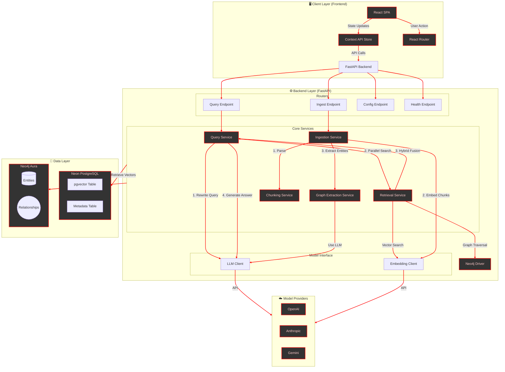

# Neo-rag v2.0 Architecture

This document outlines the high-level architecture of Neo-rag v2.0, detailing the interaction between the Frontend, Backend services, and the Dual-Database storage layer.

## System Overview

Neo-rag uses a **Hybrid Retrieval-Augmented Generation (RAG)** approach. It routes queries through both a Vector Database (for semantic understanding) and a Knowledge Graph (for structured relationships), fusing the results to provide contextually rich answers.

### Architecture Diagram

## Component Details

### 1. Frontend (Client)
Built with **React 19** and **Tailwind CSS**.
- **Context API**: Manages global state (Configuration, Health Status).
- **Setup Wizard**: Guides initial configuration and validates credentials.
- **Visual Feedback**: Real-time status indicators and "Pool Stats".

### 2. Backend Services
- **QueryService**: Orchestrates the RAG pipeline. It handles query rewriting, calls the Retrieval Service, and formats the final prompt.
- **RetrievalService**: The heart of the hybrid system. It executes:
  - **Vector Search** (Consine Similarity) in Neon.
  - **Graph Search** (Cypher) in Neo4j.
  - **Hybrid Fusion**: Merges results based on the configured `alpha` (weight).
- **IngestionService**: Processes uploaded files.
  - **Semantic Chunking**: Splits text based on meaning rather than just character count.
  - **Graph Extraction**: Uses LLMs to identify entities (Person, Place, Concept) and relations.

### 3. Data Storage
- **Neon PostgreSQL**: Stores text chunks and their embeddings using `pgvector`. Ideal for "fuzzy" semantic matching.
- **Neo4j Aura**: Stores the structured Knowledge Graph. Ideal for explicit connections and multi-hop reasoning.

## Data Flow: The Lifecycle of a Query

1. **User Input**: User asks "How does Semantic Chunking work?"
2. ** embedding**: The query is converted to a vector.
3. **Parallel Retrieval**:
   - **Vector**: Finds distinct text chunks about "chunking".
   - **Graph**: Finds the "Semantic Chunking" node and traverses to "Ingestion Service".
4. **Fusion**: The top results from both are combined.
5. **Generation**: The LLM receives the context and generates:
   > "Semantic Chunking is a process handled by the Ingestion Service that..."
