# Development Workflow

This document outlines the standard process for developing new features in the Neo-rag project. Following this workflow ensures consistency, quality, and alignment with our architectural principles.

## 🔄 Workflow Overview

Since the visual diagram may not render in all environments, here is the standard development sequence:

1.  **💡 Feature Concept**: Identify a new capability or improvement.
2.  **📝 Feature Request**: Fill out `templates/feature_request.md` with descriptions and context.
3.  **🧠 Strategic Planning**: AI (Antigravity) generates an **Implementation Plan** in `plans/`.
4.  **⚖️ Peer Review**: User reviews the plan and provides feedback.
5.  **🚀 Implementation**: Development proceeds in isolated feature branches.
6.  **✅ Verification**: Run tests and perform manual walkthroughs.
7.  **🏁 Completion**: Merge to `main`.

---

### 📊 Visual Flow (Mermaid)

```mermaid
graph TD
    A["💡 Idea"] --> B["📝 Request"]
    B --> C["🧠 Plan"]
    C --> D{"⚖️ Review"}
    D -- "Approved" --> E["🚀 Code"]
    E --> F["✅ Test"]
    F --> G["🏁 Done"]
    D -- "Changes" --> C
```

## Workflow Steps

1.  **Feature Request**: The user defines a new feature by filling out a `feature_request.md` template. This template prompts for a clear description, references to examples, and any other critical context.

2.  **Plan Generation**: The AI assistant (Roo) reads the feature request, `CLAUDE.md` rules, the project architecture, and the code in the `examples/` directory. It then generates a detailed, step-by-step execution plan and saves it in a new `plans/` directory.

3.  **Plan Approval**: The user reviews the execution plan. This is a critical step to align on the approach before any code is written.

4.  **Implementation**: Once the plan is approved, the user and AI switch to **Code Mode**, and the AI executes the plan to build the feature.

5.  **Code Review**: The user reviews the final code to ensure it meets all requirements.