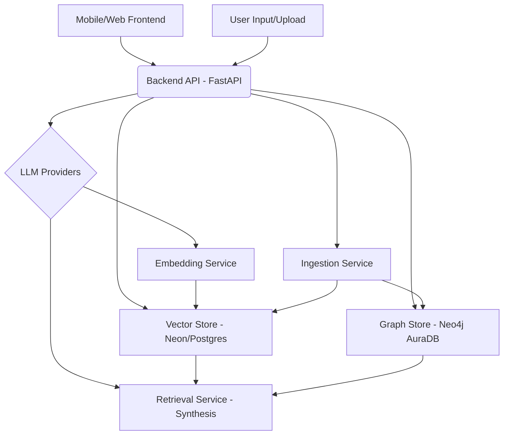

# Architecture Overview: Hybrid RAG Application

## High-Level Diagram

## Component Breakdown

### 1. Frontend (Mobile-First)
-   **Technology**: React Native or Flutter (to be decided in Phase 3).
-   **Role**:
    -   User Interface for interaction.
    -   Configuration of LLM API keys and database connections.
    -   Document/text upload for ingestion.
    -   Query input for retrieval.
    -   Display of retrieval results, including vector and graph breakdowns.
-   **Key Principles**: Mobile-first design, responsive, secure handling of credentials (never cached locally).

### 2. Backend API (FastAPI)
-   **Technology**: Python with FastAPI.
-   **Role**:
    -   Authentication and authorization (future phase).
    -   Secure storage and verification of LLM API credentials.
    -   Exposing RESTful endpoints for data ingestion and retrieval.
    -   Orchestration layer between frontend, LLM providers, and databases.
-   **Endpoints**:
    -   `/config`: Retrieve configured API keys (masked) and DB connection status.
    -   `/ingest`: Accept text content and metadata for ingestion.
    -   `/retrieve`: Accept user queries and return hybrid retrieval results.

### 3. LLM Providers
-   **Supported**: OpenAI, Anthropic, Cohere, and local inference endpoints.
-   **Role**:
    -   **Embedding Generation**: Used by `EmbeddingService` to convert text into vector embeddings.
    -   **Answer Synthesis**: Used by `RetrievalService` to generate coherent answers from retrieved context.
    -   **Entity/Relationship Extraction**: (Future enhancement) Used by `IngestionService` to parse text into graph structures.

### 4. Vector Store (Neon/Postgres with pgvector)
-   **Technology**: PostgreSQL with `pgvector` extension, hosted on Neon.
-   **Role**:
    -   Stores document chunks and their corresponding vector embeddings.
    -   Enables efficient similarity search (vector search) based on query embeddings.
-   **Schema**: `documents` table (`id`, `content`, `embedding`, `metadata`).

### 5. Graph Store (Neo4j AuraDB)
-   **Technology**: Neo4j AuraDB (managed graph database).
-   **Role**:
    -   Stores extracted entities and their relationships.
    -   Enables semantic search and complex relationship traversal.
-   **Schema**: Auto-inferred or user-provided JSON/YAML schema for nodes and edges.

### 6. Core Services

#### a. Embedding Service (`embedding_service.py`)
-   **Role**: Interfaces with LLM providers (OpenAI, Cohere) to generate vector embeddings for text.
-   **Input**: Text string, desired embedding model.
-   **Output**: List of floats (vector embedding).

#### b. Ingestion Service (`ingestion_service.py`)
-   **Role**: Processes raw text for storage in both vector and graph databases.
-   **Workflow**:
    1.  **Chunking**: Splits large texts into smaller, manageable chunks using `RecursiveCharacterTextSplitter`.
    2.  **Embedding**: Calls `EmbeddingService` to generate embeddings for each chunk.
    3.  **Vector Storage**: Inserts chunks and embeddings into Neon's `documents` table.
    4.  **Entity/Relationship Extraction**: (Placeholder) Identifies entities and relationships from text.
    5.  **Graph Storage**: Creates nodes and relationships in Neo4j AuraDB.

#### c. Retrieval Service (`retrieval_service.py`)
-   **Role**: Executes hybrid retrieval and synthesizes final answers.
-   **Workflow (Two-Pass Hybrid Retrieval)**:
    1.  **Pass 1**:
        -   Performs vector search in Neon using query embedding.
        -   Performs graph search in Neo4j based on the query.
        -   Merges and normalizes initial results to form a refined context.
    2.  **Pass 2**:
        -   Re-queries both databases with the refined context (or more targeted queries).
        -   Merges and produces a comprehensive context.
    3.  **Synthesis**: Uses an LLM (OpenAI, Anthropic, or Cohere) to generate a natural language answer based on the final combined context.

## Data Flow
-   **Ingestion**: User Upload (Frontend) → Backend API (`/ingest`) → Ingestion Service → Embedding Service + Neon + Neo4j.
-   **Retrieval**: User Query (Frontend) → Backend API (`/retrieve`) → Retrieval Service → Embedding Service + Neon + Neo4j + LLM Providers.

## Security Considerations
-   API keys are stored encrypted in the backend.
-   Mobile app never caches credentials locally.
-   Backend verifies API keys by pinging provider endpoints.

## Scalability
-   FastAPI provides asynchronous capabilities.
-   Neon and Neo4j AuraDB are managed services designed for scalability.
-   LLM providers handle their own scaling.
