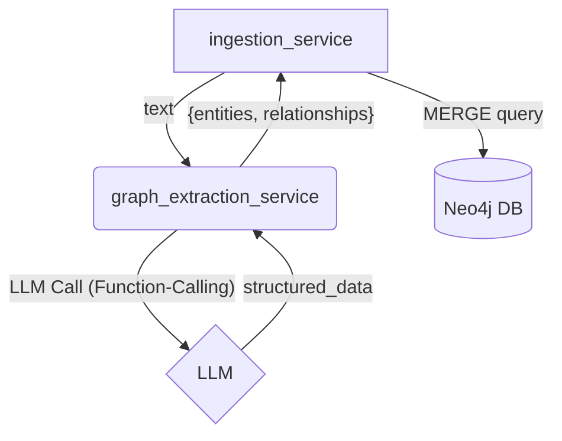

# Plan: Knowledge Graph Ingestion - Part 1

**Epic:** Knowledge Graph Construction
**Feature:** Implement a service to extract entities and relationships from text to populate the Neo4j knowledge graph.

## 1. Goal

The primary goal of this feature is to create the foundational service that can parse unstructured text and convert it into a structured graph format (nodes and relationships), which can then be stored in our Neo4j database.

## 2. Architecture

The new service, `graph_extraction_service.py`, will be called by the existing `ingestion_service.py`.

## 3. Step-by-Step Plan

| Step | File(s) to Modify | Description | Validation |
| :--- | :--- | :--- | :--- |
| 1 | `backend/app/models/data_models.py` | Define Pydantic models `Node` and `Relationship` to ensure the LLM's output is structured and validated. | Code review and type checking. |
| 2 | `backend/app/services/graph_extraction_service.py` | Create the new service file and the main function `extract_entities_and_relationships`. | File exists. |
| 3 | `backend/app/services/graph_extraction_service.py` | Implement the logic using `langchain` to call an LLM with a specific prompt and our Pydantic models as the function-calling schema. | Function returns expected dictionary format. |
| 4 | `tests/services/test_graph_extraction_service.py` | Create a unit test for the new service. | Test file exists. |
| 5 | `tests/services/test_graph_extraction_service.py` | Write a test that mocks the LLM call and verifies that the service correctly parses the mocked response. | `pytest tests/services/test_graph_extraction_service.py` passes. |
| 6 | `backend/app/services/ingestion_service.py` | Modify the `ingest_text` function to call the new extraction service. | Code review. |
| 7 | `backend/app/services/ingestion_service.py` | Add logic to take the extracted entities/relationships and write them to the Neo4j database using `MERGE` queries. | Manual test via API confirms data in Neo4j. |
| 8 | `docs/AGENT_WORKFLOWS.md` | Update the "Ingestion Workflow" diagram and description to include the new graph extraction step. | Documentation accurately reflects the new architecture. |

## 4. Success Criteria

- The `/ingest` endpoint successfully processes text, populating both the vector store and the Neo4j knowledge graph.
- All new and existing unit tests pass.
- The documentation is updated.