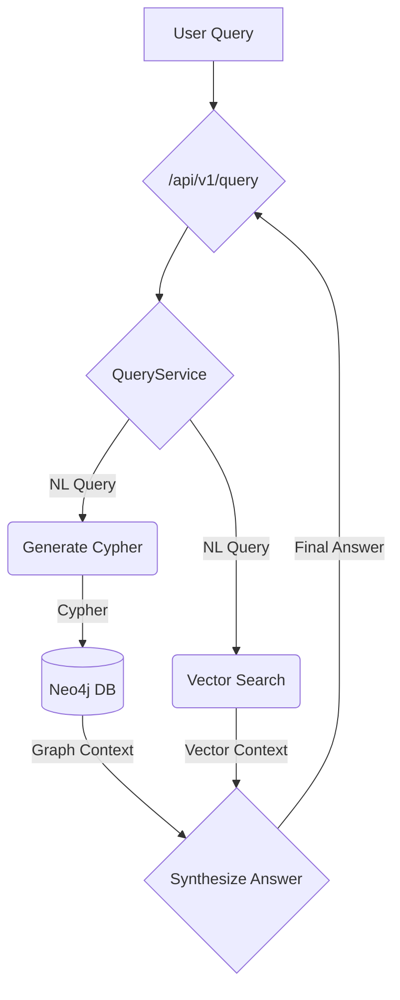

# Plan: Hybrid Query Service

**Epic:** Hybrid Retrieval
**Feature:** Implement a service that queries both the vector and graph databases, synthesizes the results, and exposes it via a new API endpoint.

## 1. Goal

The goal is to create a non-agentic, hybrid RAG endpoint that leverages both our structured (Neo4j) and unstructured (Neon) data stores to provide comprehensive answers to user queries.

## 2. Architecture

## 3. Step-by-Step Plan

| Step | File(s) to Modify | Description | Validation |
| :--- | :--- | :--- | :--- |
| 1 | `backend/app/models/api_models.py` | Create the new file and define `QueryRequest` and `QueryResponse` Pydantic models. | File exists and models are defined correctly. |
| 2 | `backend/app/services/query_service.py` | Create the new service file with a `QueryService` class structure. | File exists. |
| 3 | `backend/app/services/query_service.py` | Implement the hybrid query orchestration logic within the `QueryService` class. This includes Cypher generation, vector search, and the final answer synthesis chain. | Code review. |
| 4 | `tests/services/test_query_service.py` | Create a unit test file for the new service. | File exists. |
| 5 | `tests/services/test_query_service.py` | Write unit tests for the `QueryService`, mocking all external calls (databases, LLMs). | `pytest tests/services/test_query_service.py` passes. |
| 6 | `backend/app/main.py` | Create the new `POST /api/v1/query` endpoint, importing and using the `QueryService` and API models. | Endpoint is available and returns expected responses in testing. |
| 7 | `docs/AGENT_WORKFLOWS.md` | Add a new section and diagram for the "Hybrid Query Workflow" to document the new retrieval path. | Documentation is updated. |

## 4. Success Criteria

- The `POST /api/v1/query` endpoint is functional and returns a synthesized answer along with the graph and vector contexts.
- All new unit tests pass.
- The documentation is updated to reflect the new hybrid query architecture.