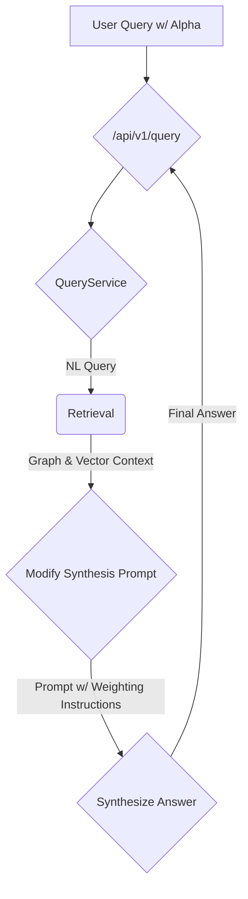

# Plan: Custom Weighting for Hybrid Search

**Epic:** Hybrid Retrieval
**Feature:** Implement a custom weighting mechanism (`alpha` parameter) to control the balance between graph and vector search results during answer synthesis.

## 1. Goal

The goal is to enhance the `QueryService` to allow users to specify the relative importance of graph context versus vector context, enabling more tunable and precise answers.

## 2. Architecture

The core change will be in the `QueryService`, where the `alpha` parameter will be used to modify the prompt sent to the final synthesis LLM.

## 3. Step-by-Step Plan

| Step | File(s) to Modify | Description | Validation |
| :--- | :--- | :--- | :--- |
| 1 | `backend/app/models/api_models.py` | Update the `QueryRequest` model to include `alpha: Optional[float] = 0.5`. Add a `Field` validator to ensure the value is between 0.0 and 1.0. | Code review and type checking. |
| 2 | `backend/app/services/query_service.py` | Update the `query` and `_synthesize_answer` method signatures to accept the new `alpha` parameter. | Code compiles and signatures match. |
| 3 | `backend/app/services/query_service.py` | In `_synthesize_answer`, dynamically modify the prompt template based on the `alpha` value to instruct the LLM on how to weigh the contexts. | Code review. |
| 4 | `tests/services/test_query_service.py` | Update the unit test for the `QueryService` to include scenarios for different `alpha` values (e.g., 0.0, 0.5, 1.0), asserting that the correct prompt is generated each time. | `pytest tests/services/test_query_service.py` passes. |
| 5 | `backend/app/main.py` | Update the `/api/v1/query` endpoint to extract the `alpha` parameter from the request and pass it to the `query_service`. | Endpoint accepts the new parameter. |
| 6 | `docs/AGENT_WORKFLOWS.md` | Update the "Hybrid Query Workflow" section to mention the new `alpha` parameter and its function. | Documentation is updated. |

## 4. Success Criteria

- The `POST /api/v1/query` endpoint successfully accepts and processes the `alpha` parameter.
- The answer synthesis prompt is correctly modified based on the `alpha` value, as verified by unit tests.
- All unit tests pass.
- The documentation is updated to reflect the new feature.