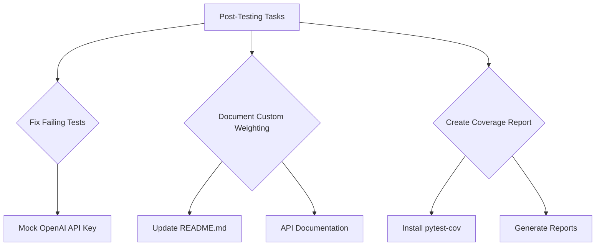

# Plan: Post-Testing Tasks

**Epic:** Hybrid Retrieval
**Feature:** Address post-testing tasks including fixing failing tests, documenting custom weighting functionality, and creating test coverage reports.

## 1. Goal

The goal is to address the remaining tasks after completing the comprehensive testing for the custom weighting feature:
1. Fix the failing ingestion service test by properly handling the OpenAI API key requirement
2. Document the newly implemented custom weighting functionality in the API documentation
3. Create a comprehensive test coverage report

## 2. Architecture

This plan will address three separate but related tasks that improve the overall quality and usability of the project.

## 3. Step-by-Step Plan

### Task 1: Fix Failing Ingestion Service Test

| Step | File(s) to Modify | Description | Validation |
| :--- | :--- | :--- | :--- |
| 1 | `tests/services/test_ingestion_service.py` | Analyze the current ingestion service test to understand why it's failing | Identify the root cause of the failure |
| 2 | `tests/services/test_ingestion_service.py` | Modify the test to mock the OpenAI API key environment variable | Test passes without requiring actual API key |
| 3 | `tests/services/test_ingestion_service.py` | Add a skip condition for when the OpenAI API key is not available | Test gracefully skips when API key is not set |
| 4 | `tests/services/test_ingestion_service.py` | Verify that the test now passes without requiring an actual OpenAI API key | All tests in the file pass |

### Task 2: Document Custom Weighting Functionality

| Step | File(s) to Modify | Description | Validation |
| :--- | :--- | :--- | :--- |
| 1 | `README.md` | Review the existing README.md and documentation files | Understand current documentation structure |
| 2 | `README.md` | Create a new section in README.md documenting the custom weighting functionality | Section is added with clear explanation |
| 3 | `README.md` | Add API endpoint documentation for the /api/v1/query endpoint with alpha parameter | API documentation is clear and accurate |
| 4 | `README.md` | Include examples of how to use the alpha parameter in API requests | Examples are working and illustrative |

### Task 3: Create Test Coverage Report

| Step | File(s) to Modify | Description | Validation |
| :--- | :--- | :--- | :--- |
| 1 | `requirements.txt` | Research and install pytest-cov for test coverage reporting | pytest-cov is added to requirements |
| 2 | N/A | Run tests with coverage reporting enabled | Coverage data is generated successfully |
| 3 | N/A | Generate an HTML coverage report | HTML report is created and accessible |
| 4 | `docs/test_coverage_summary.md` | Create a summary report of test coverage statistics | Summary includes key metrics and analysis |

## 4. Success Criteria

- The ingestion service test no longer fails due to missing OpenAI API key
- The custom weighting functionality is well-documented in the README.md
- A comprehensive test coverage report is generated and available
- All existing functionality continues to work as expected